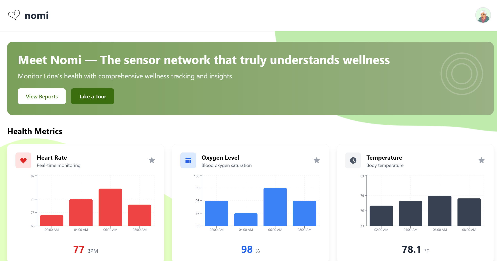
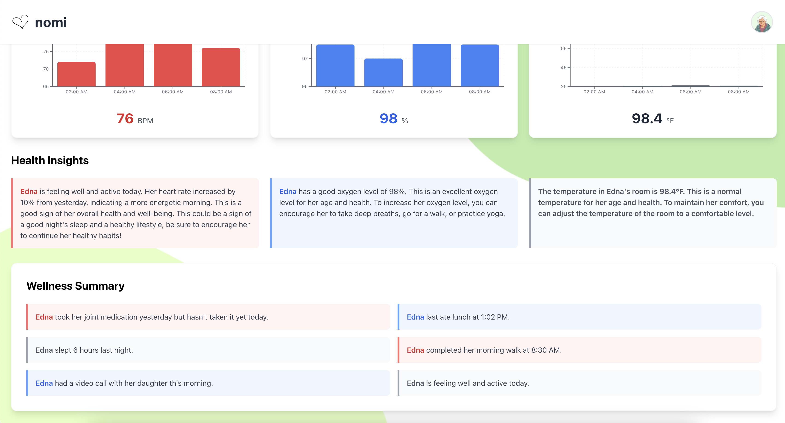
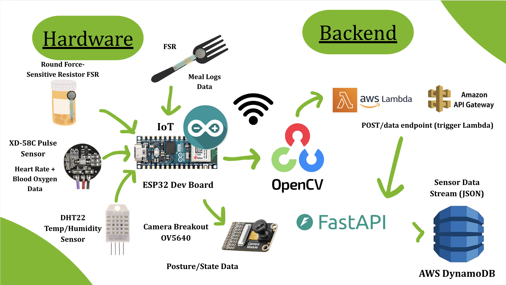
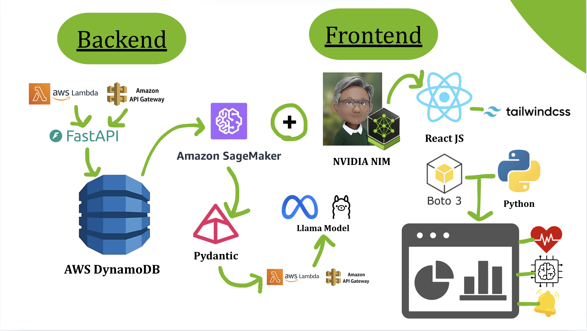
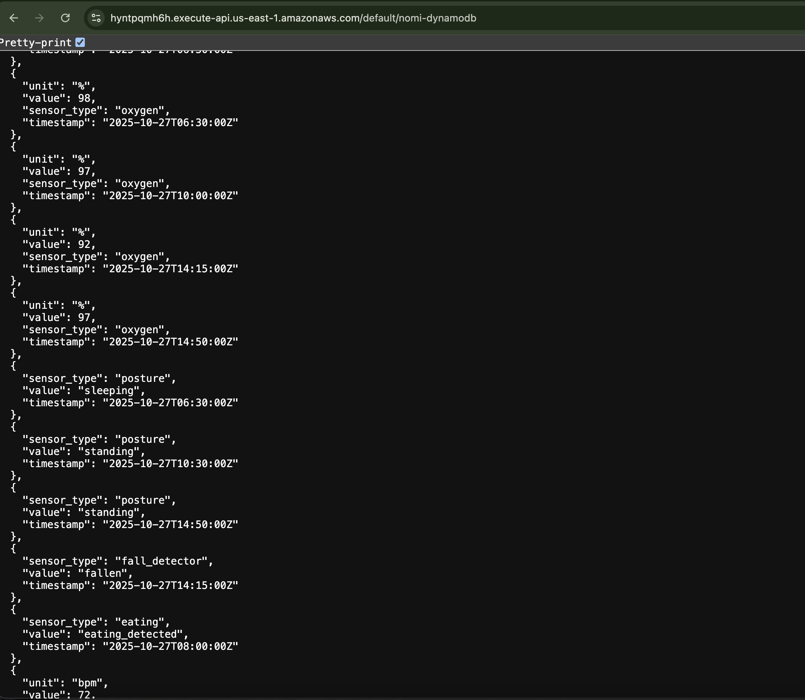
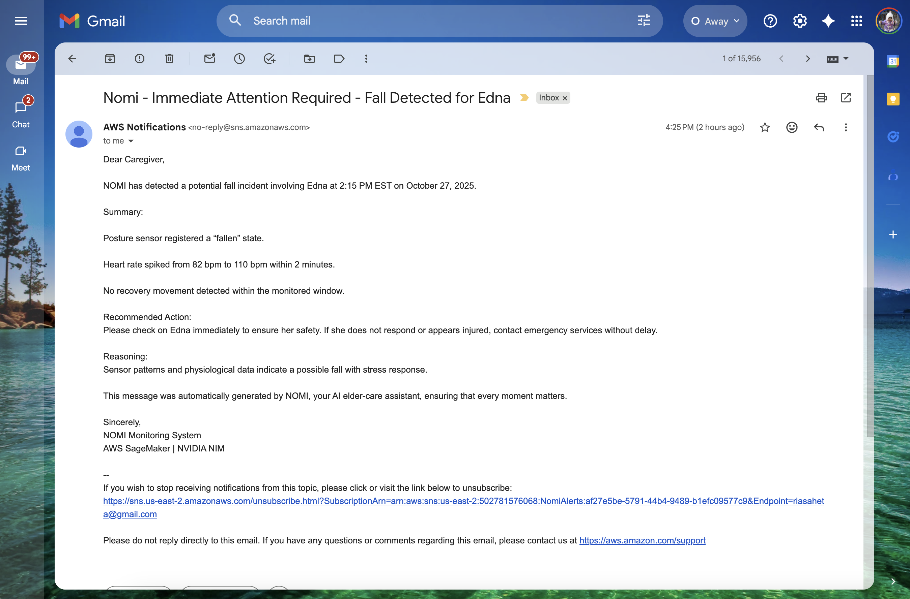

# 🧠 NOMI: Agentic AI Elder Care System

NOMI is an AI-powered companion system for elder care. It combines real-time IoT sensing, cloud analytics, and NVIDIA-powered reasoning AI to detect events, analyze context, and notify caregivers.

## 🏆 Built For

**Agentic AI Unleashed: AWS & NVIDIA Hackathon**

## 🧩 Table of Contents

* [Overview](#overview)
* [Core Features](#core-features)
* [Architecture Diagram](#architecture-diagram)
* [Technology Stack](#technology-stack)
* [Project Structure](#project-structure)
* [Backend Setup (FastAPI)](#backend-setup-fastapi)
* [Frontend Setup (React)](#frontend-setup-react)
* [NVIDIA NIM Integration](#nvidia-nim-integration)
* [SageMaker Deployment Notes](#sagemaker-deployment-notes)
* [Local Testing](#local-testing)
* [Example Alert Email](#example-alert-email)
* [Future Enhancements](#future-enhancements)
* [Contributors](#contributors)

## Overview

NOMI acts as an intelligent home health assistant. It ingests sensor data — heart rate, oxygen, posture (standing/sleeping/fallen), eating/meds events, temperature/humidity — and converts it into clear, caregiver-facing insights using NVIDIA's Nemotron-based NIM.

### What It Detects

* Vital signs (heart rate, oxygen)
* Temperature & humidity
* Posture (standing, sleeping, fallen)
* Eating & medication activity
* Fall or inactivity incidents

## Core Features

✅ ESP32 → AWS DynamoDB ingestion

✅ AI reasoning summaries via NVIDIA NIM (Llama-3.1-Nemotron-8B)

✅ Email alerts for fall detection & abnormal vitals

✅ React + Tailwind dashboard with live charts (Recharts)

✅ Optional OpenCV local fall detection (privacy-preserving)




_Main caregiver dashboard showing live charts for heart rate, oxygen levels, and posture tracking_


## Architecture Diagram

```
[ Sensors ] --> [ ESP32 / NodeRED ] --> [ AWS DynamoDB ]
                                       \
                                        -> [ AWS Lambda + API Gateway ] -> [ FastAPI Backend ]
                                                                        \
                                                                         -> [ NVIDIA NIM (Nemotron) ] -> Reasoned insights
                                                                                                        \
                                                                                                         -> [ React Frontend ] + Alerts (email/SNS)
```




_Visual flow from sensors → DynamoDB → Backend → NIM → Frontend_

## Technology Stack

### AI & Reasoning

* NVIDIA NIM (Llama-3.1-Nemotron-8B)
* OpenAI-compatible JSON API

### Cloud

* AWS DynamoDB (sensor store)
* AWS Lambda + API Gateway (public read endpoint)
* AWS SNS / Gmail SMTP (alerts)

### Backend

* FastAPI (Python 3.9+), boto3, pydantic, python-dotenv, requests

### Frontend

* React, TailwindCSS, Recharts

### Hardware

* ESP32 + pulse sensor, force sensors (pill bottle / eating), temp/humidity
* OpenCV (optional on-device posture/fall)

## Project Structure

```
nomi/
├── backend/
│   ├── app.py                 # FastAPI backend
│   ├── requirements.txt
│   ├── .env                   # local config (not committed)
│   └── README.md
│
├── frontend/
│   ├── src/
│   │   ├── App.js
│   │   ├── components/
│   │   │   ├── Dashboard.js
│   │   │   └── Charts.js
│   │   └── config.js
│   ├── package.json
│   └── README.md
│
└── docs/
    ├── dashboard.png
    ├── architecture.png
    └── demo_video.mp4
```

## Backend Setup (FastAPI)

### 1) Create & Activate Virtual Environment

```bash
cd backend
python3 -m venv venv
source venv/bin/activate
```

> **Note:** If pip is missing on macOS, reinstall ensurepip:
>
> ```bash
> python3 -m ensurepip --upgrade
> python3 -m pip install --upgrade pip
> ```

### 2) Install Dependencies

```bash
pip install -r requirements.txt
```

**requirements.txt example:**

```
fastapi==0.115.0
uvicorn==0.30.6
pydantic==2.9.2
python-dotenv==1.0.1
requests==2.32.3
boto3==1.35.25
```

### 3) Environment Variables

Create `backend/.env`:

```env
# NVIDIA NIM (hosted) — OpenAI-compatible endpoint
NGC_API_KEY=your_nvidia_ngc_api_key
NIM_ENDPOINT=https://integrate.api.nvidia.com/v1/chat/completions

# DynamoDB read endpoint (via API Gateway + Lambda)
DYNAMO_API_URL=https://<your-id>.execute-api.us-east-1.amazonaws.com/default/nomiData

# Optional: Email alerts (use an App Password for Gmail)
EMAIL_SENDER=your_email@gmail.com
EMAIL_RECIPIENT=caregiver_email@gmail.com
EMAIL_PASSWORD=your_gmail_app_password

# Optional: AWS credentials if calling SNS directly from backend
AWS_ACCESS_KEY_ID=xxxxx
AWS_SECRET_ACCESS_KEY=xxxxx
AWS_DEFAULT_REGION=us-east-1
```


_Populated nomi-data table in console_


### 4) Run FastAPI

```bash
uvicorn app:app --reload
```

* API root: `http://127.0.0.1:8000/`
* Data passthrough: `GET /data`
* Reasoning endpoint: `POST /analyze`

## Frontend Setup (React)

### 1) Install & Start

```bash
cd frontend
npm install
npm start
```

### 2) Configure Backend URL

Create or edit `frontend/src/config.js`:

```javascript
export const API_BASE = "http://127.0.0.1:8000";
```

### 3) Example Fetch (inside React component)

```javascript
import { API_BASE } from "./config";

async function loadData() {
  const res = await fetch(`${API_BASE}/data`);
  const data = await res.json();
  console.log(data);
}

async function getSummary() {
  const res = await fetch(`${API_BASE}/analyze`, {
    method: "POST",
    headers: { "Content-Type": "application/json" },
    body: JSON.stringify({
      posture: "standing",
      pill_status: "closed",
      sensor_data: [] // omit to auto-pull from Dynamo
    })
  });
  const out = await res.json();
  console.log(out);
}
```

## NVIDIA NIM Integration

The backend calls NIM using an OpenAI-like API.

```python
import os, requests

headers = {
    "Authorization": f"Bearer {os.getenv('NGC_API_KEY')}",
    "Content-Type": "application/json",
}

payload = {
    "model": "nvidia/llama-3.1-nemotron-nano-8b-v1",
    "messages": [
        {"role": "user", "content": "Summarize recent health readings."}
    ],
    "max_tokens": 200,
    "temperature": 0.5
}

resp = requests.post(os.getenv("NIM_ENDPOINT"), headers=headers, json=payload)
print(resp.json())
```

In `app.py`, `/analyze` builds a structured prompt and returns `{ summary, recommendation, reasoning }`.

## SageMaker Deployment Notes

**Sandbox constraint:** In the Vocareum AWS account, SageMaker endpoint creation is blocked by Service Control Policies (SCP). That's expected in the hackathon environment.

**Production path (for judges):**

1. Subscribe to NVIDIA NIM model in AWS Marketplace
2. Use Model Package ARN to create a SageMaker Model and Endpoint

```python
import boto3, json, time
sm = boto3.client("sagemaker")
runtime = boto3.client("sagemaker-runtime")

nim_model_package_arn = "arn:aws:sagemaker:us-east-1:865070037744:model-package/llama3-1-nemotron-nano-8b-v1-n-710c29bc58f0303aac54c77c70fc229a"

sm.create_model(
    ModelName="nomi-nim-model",
    PrimaryContainer={"ModelPackageName": nim_model_package_arn},
    ExecutionRoleArn="<YOUR_SAGEMAKER_EXEC_ROLE_ARN>",
    EnableNetworkIsolation=True,
)

sm.create_endpoint_config(
    EndpointConfigName="nomi-nim-config",
    ProductionVariants=[{
        "VariantName": "AllTraffic",
        "ModelName": "nomi-nim-model",
        "InitialInstanceCount": 1,
        "InstanceType": "ml.g5.12xlarge"
    }]
)

sm.create_endpoint(
    EndpointName="nomi-nim-endpoint",
    EndpointConfigName="nomi-nim-config"
)
```

3. Use `runtime.invoke_endpoint` for inference.

For this hackathon, we use NVIDIA's hosted NIM (above), which fulfills the "Effective use of NVIDIA NIM services" requirement.

## Local Testing

| Step | What to do                                                              |
| ---- | ----------------------------------------------------------------------- |
| 1    | Run backend: `uvicorn app:app --reload`                                 |
| 2    | Run frontend: `npm start`                                               |
| 3    | Visit `http://localhost:3000`                                           |
| 4    | Data panel shows DynamoDB (via `/data`)                                 |
| 5    | Insights card shows LLM summary (via `/analyze`)                        |
| 6    | Trigger an email alert by including a "fallen" event or abnormal vitals |

## Example Alert Email

**Subject:**

```
⚠️ NOMI Alert: Fall Detected for Edna
```

**Body:**

```
Dear Caregiver,

NOMI detected a FALL event for Edna at 2:14 PM.
Recent vitals:
• Heart rate: 110 bpm
• Oxygen: 92%
• Room: 24.8°C / 47%

Immediate assistance is advised.
— NOMI Safety System
```


_Sample fall detection alert email received in caregiver's inbox_

## Future Enhancements

* MQTT ingest from ESP32 for real-time streaming
* Alexa voice integration
* Full SageMaker-managed deployment
* Wearable/EHR integration
* RAG-based caregiver Q&A and timelines

## Contributors

| Name               | Role                                       |
| ------------------ | ------------------------------------------ |
| Ria Saheta         | System Architecture, AI Reasoning, Backend |
| Crystal [Lastname] | Frontend/UI, AWS Integration, DevOps       |

## Submission Checklist

✅ Clear README (this file)

✅ Public GitHub repo

✅ 3-minute demo video (`docs/demo_video.mp4`)

✅ NVIDIA NIM + AWS integration

✅ Local run instructions + production notes

***

**Repo:** `https://github.com/<your-username>/nomi`

**Demo Video:** add link in `docs/demo_video.mp4`
